# 도커로 CI 구축 연습하기 (젠킨스, SpringBoot, slack)
안녕하세요? 이번 시간엔 도커로 CI 구축 연습하기 (젠킨스, SpringBoot, slack) 예제를 진행해보려고 합니다.  
모든 코드는 [Github](https://github.com/jojoldu/springboot-jenkins-docker-slack)에 있기 때문에 함께 보시면 더 이해하기 쉬우실 것 같습니다.  
(공부한 내용을 정리하는 [Github](https://github.com/jojoldu/blog-code)와 세미나+책 후기를 정리하는 [Github](https://github.com/jojoldu/review), 이 모든 내용을 담고 있는 [블로그](http://jojoldu.tistory.com/)가 있습니다. )<br/>

탐내에서 **젠킨스로 빌드/배포**를 관리하고 있습니다.  
여태 CI를 경험해본적이 없어 연습을 해봐야겠다고 생각을 하였습니다.  
개인 서버가 별도로 없어서 어디에 구축을 해야하나 고민하던 중, 도커가 생각나서 도커에 구축하여 같이 연습을 하게 되었습니다.  
도커와 젠킨스 초보이다보니 잘못된 내용이 있을 수 있습니다.  
발견하시면 언제든 댓글 혹은 풀리퀘스트 부탁드리겠습니다.  

## 젠킨스 & Github 연동
젠킨스는 도커 컨테이너를 이용해서 사용할 예정입니다.  
혹시나 도커에 대해서 모르시는 분들은 [링크](https://subicura.com/2017/01/19/docker-guide-for-beginners-1.html)를 참고하세요.  

### 스프링부트 프로젝트 생성
먼저 빌드 테스트를 위해 간단한 스프링 부트 프로젝트를 생성하겠습니다.  
빌드도구는 ```Gradle```을 사용합니다.  
본인의 IDE로 부트 프로젝트를 생성 후, Task 실행 테스트를 위해 간단한 Task만 ```build.gradle```에 추가하겠습니다.  
  
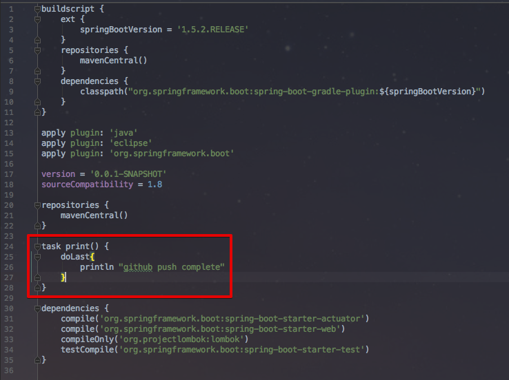

단계별로 나눠서 진행할 예정이라 젠킨스와 Github 연동 후, 바로 Task를 하기 위한 ```print``` Task를 등록하였습니다.  
만드신 스프링부트 프로젝트는 Github로 push하겠습니다.  

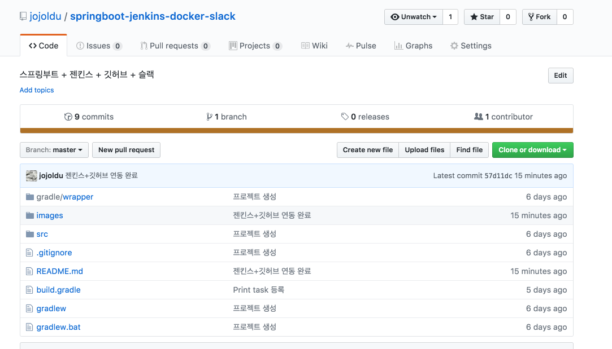

(혹시나 Github에 등록해보신적이 없으시다면 이전에 작성한 [포스팅](http://jojoldu.tistory.com/16)을 참고하세요!)
Github에 push 하셨다면 이제 본격적으로 시작하겠습니다.  

### 젠킨스 도커 컨테이너 설치
위 링크를 통해 젠킨스를 설치하셨다면 도커의 Kitematic을 실행합니다.  
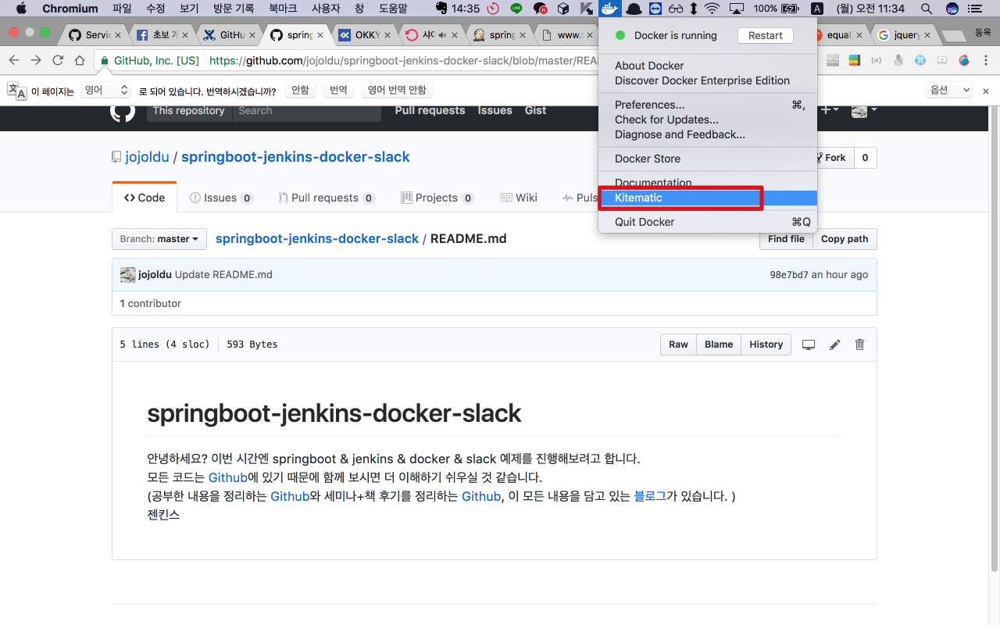

Kitematic에 로그인 하신뒤, 접속하시면 아래와 같이 검색창과 추천 컨테이너 리스트가 등장합니다.  
젠킨스를 선택해서 create 버튼을 클릭합니다.  


그럼 아래와 같이 설치가 진행됩니다.  

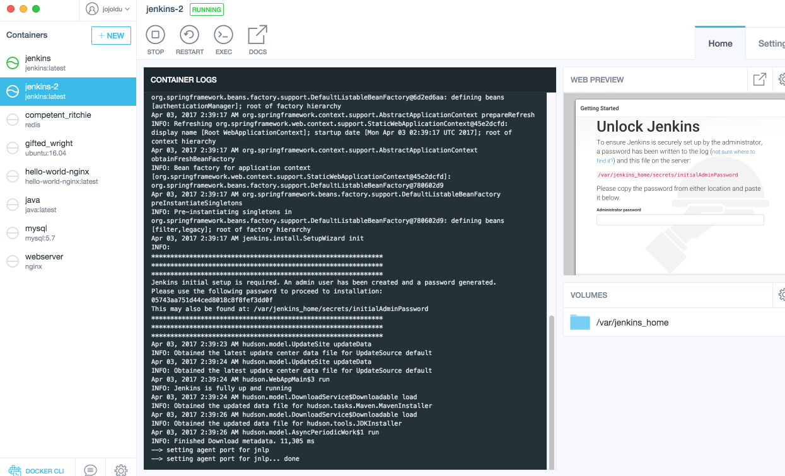

터미널을 열어 젠킨스 컨테이너가 잘 설치되었는지 확인하겠습니다.  

```
docker ps -a
```

(전체 컨테이너 리스트를 확인합니다.)

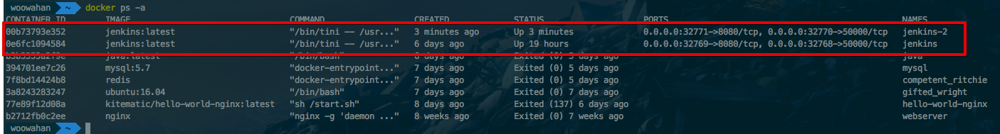

저는 기존에 설치된 젠킨스가 있어 2개의 젠킨스 컨테이너가 구동되고 있습니다.  
젠킨스 컨테이너의 8080포트가 localhost의 32769 포트로 연결되었음을 확인할 수 있습니다.  
브라우저를 열어 localhost:32769 로 접속하겠습니다.  
접속하시면 아래와 같이 젠킨스의 비밀번호를 입력하는 페이지가 출력됩니다.

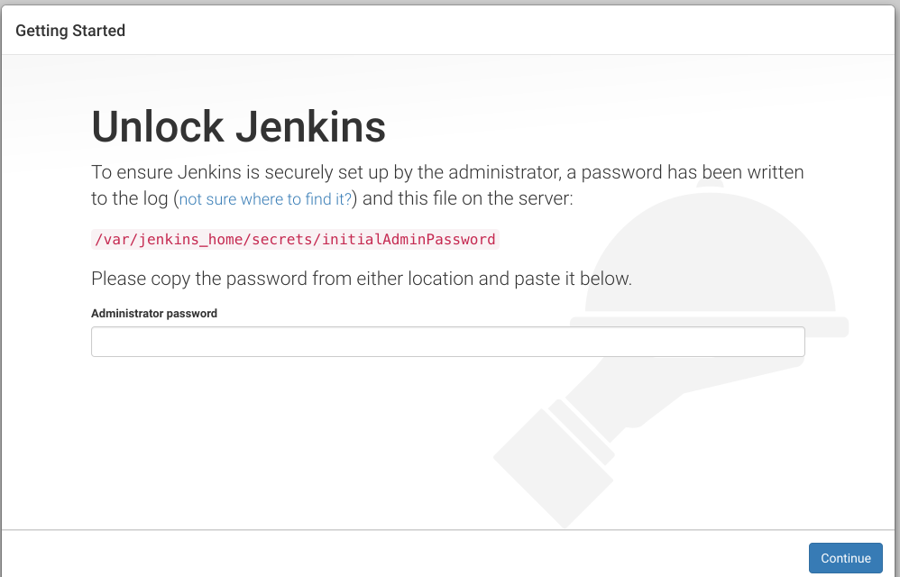

화면에 출력된 경로에 가면 젠킨스 비밀번호가 있습니다. 직접 젠킨스 컨테이너에 접속하여 비밀번호를 찾아보겠습니다.  
터미널을 열어 아래처럼 입력하겠습니다.  


명령어 입력 후, 젠킨스 컨테이너에 bash로 접속된 것을 확인할 수 있습니다.  
경로를 따라 패스워드를 찾겠습니다.  


출력된 패스워드를 브라우저에 입력하시면 젠킨스 설치페이지로 이동하게 됩니다.  
여기서 **install suggested plugins** 를 선택하시면 많이 사용되는 플러그인들이 포함되어 자동 설치되니 **install suggested plugins**로 설치를 하겠습니다.  
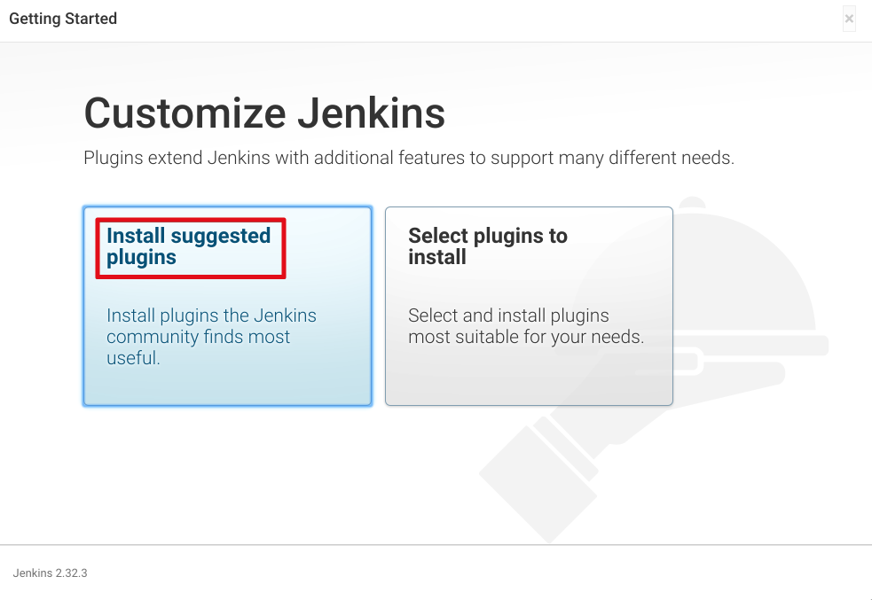

설치가 끝나면 관리자 계정을 생성하시고 접속하겠습니다.  
(저는 새로 설치하게되서 포트가 다르지만 처음 설치하시는 분들은 32769포트로 접속하시면 됩니다.)  
  


접속화면이 잘 보이신다면 설치가 잘 된것입니다!  
수고하셨습니다!
젠킨스 설치가 끝났으니 이제 Github 연동을 진행해보겠습니다.  

### 젠킨스 설정
원래는 Github 플러그인을 별도로 설치해야하지만, 젠킨스 설치단계에서 **install suggested plugins**을 선택했기 때문에 이미 설치되어있어 이부분은 생략하겠습니다.  
(혹시나 젠킨스 컨테이너를 다시 시작해야 한다면 ```docker start jenkins```로 설치된 젠킨스 컨테이너를 실행 후, ```docker exec -it jenkins /bin/bash``` 를 입력하시면 됩니다.)  
(```docker run```은 재설치를 합니다.)  
  
젠킨스 페이지에서 ```새로운 Item```을 클릭합니다.  

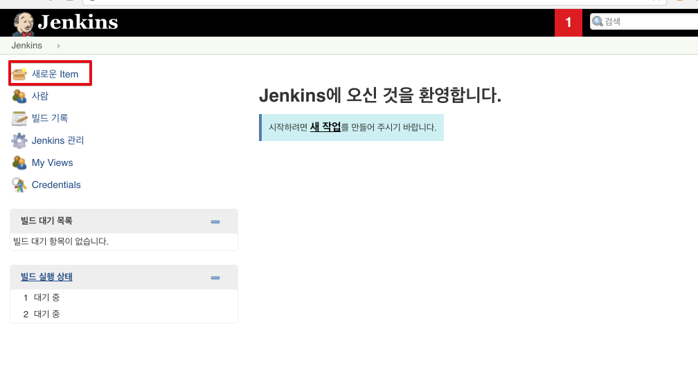

아이템명(Job명)을 등록하고 ```Freestyle Project```을 선택하여 OK를 클릭합니다.  


그럼 해당 Item(Job)의 설정화면으로 이동하게 됩니다.  
여기서부터는 젠킨스로 관리할 Github 프로젝트가 있어야하기 때문에 Github 프로젝트를 하나 생성하겠습니다.  
생성된 Github 프로젝트 페이지에서 url을 복사합니다.  
  
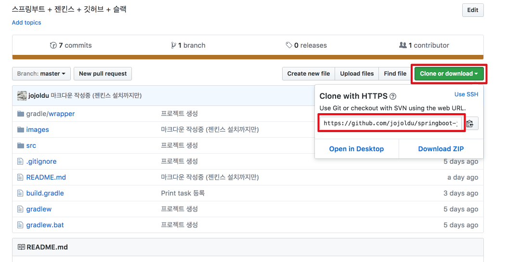

좀전에 열어놓은 ```Item 설정화면```의 소스코드관리탭에서 ```Git``` 라디오 버튼을 선택하면 git url을 입력하는 곳이 나오는데 이곳에, 복사된 url을 입력합니다.  
(참고로 젠킨스 도커 컨테이너는 이미 Git이 설치된 상태로 생성되니 별도의 Git 설치가 필요하지 않습니다.)  


이후 ```Add``` 버튼을 클릭하면 아래와 같은 화면이 나타나는데

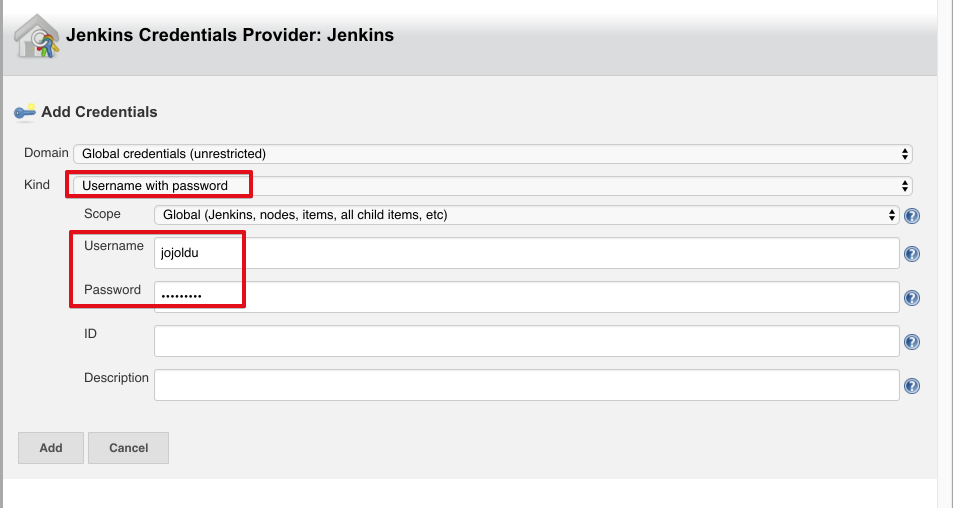

kind를 ```username with password```로 선택하시고, 해당 github 프로젝트의 **github 계정과 비밀번호**를 입력하시면 됩니다.  
  
입려이 완료되면 ```Credentials``` 선택창에 방금 등록한 계정정보가 출력되니, 이를 선택합니다.  

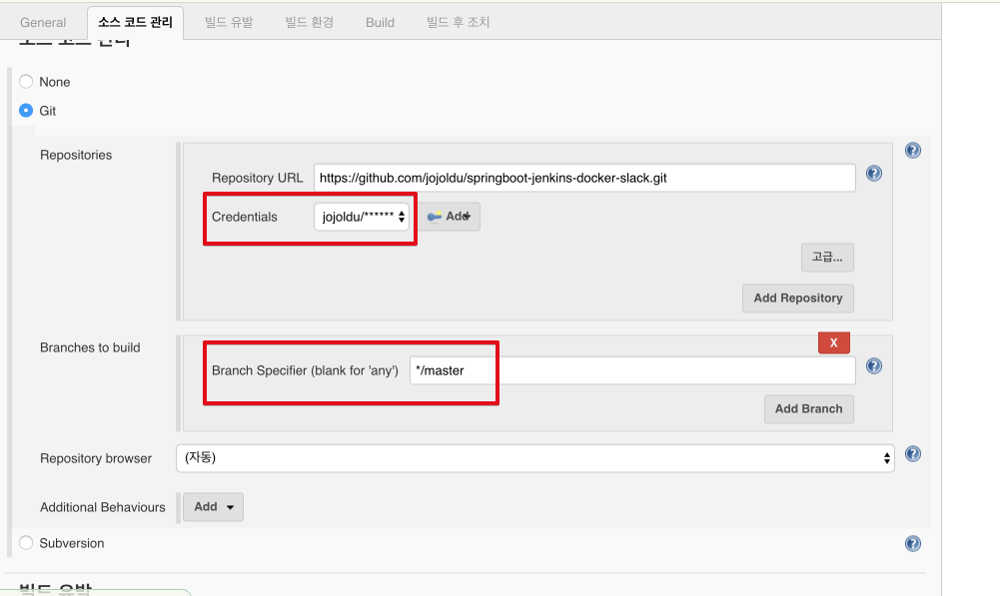

branch의 경우 master push시에 젠킨스 빌드가 관리 되도록 master를 입력하였습니다.  만약 develop브랜치에 push시에 빌드되도록  하신다면 ```*/develop```를 입력하시면 됩니다.  
  
빌드 trigger는 Githu hook trigger를 선택하시면 됩니다.  

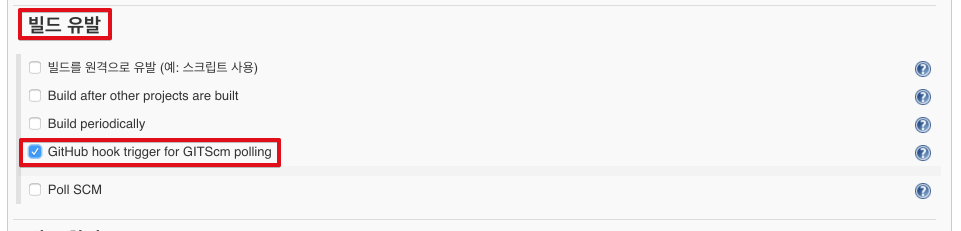

마지막으로 Github에서 push가 올 경우 실행할 빌드를 등록하겠습니다.  
바로 아래 **Build**를 클릭하셔서 ```execute shell```을 선택합니다.  

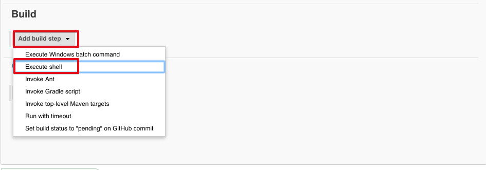

여기에 저희가 실행시킬 빌드스크립트를 작성하겠습니다.  
이미 프로젝트에 gradle 실행파일인 ```gradlew```가 포함되어있기 때문에 별도로 gradle을 설치하지 않고 ```gradlew```를 사용하도록 작성하겠습니다.  

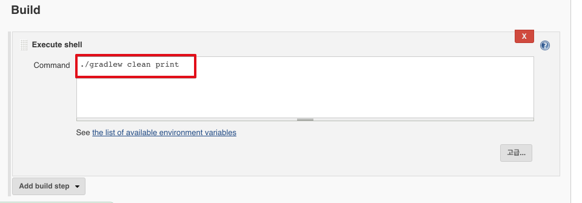

보시는것처럼 ```clean``` 수행 후, 이전에 작성한 task인 ```print```를 수행하도록 하였습니다.  
이러면 빌드 수행시 ```print```가 수행되었는지 확인할 수 있겠죠?  
마지막 저장까지 하시면 젠킨스 설정은 이제 끝이났습니다.  
Github 설정으로 가보겠습니다.  

### Github 설정
본인의 깃허브 프로젝트 우측 상단에 위치한 ```Settings```을 클릭합니다.  

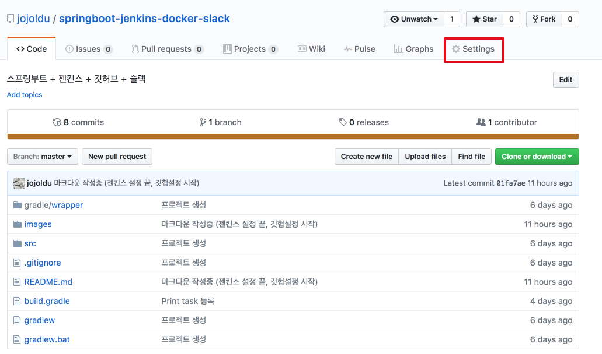

Settings로 이동후, ```Add service``` 클릭 후, ```Jenkins(Github plugin)```을 검색하여 클릭합니다.  

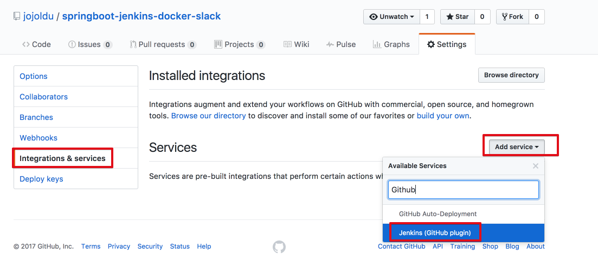

서비스 등록 페이지로 이동하시면 ```Jenkins hook url``` 입력란이 보이실텐데요, 저희가 설치한 젠킨스의 주소를 입력해야합니다.  
하지만, 여기서 ```localhost```를 입력하게 되면 Github 서버의 ```localhost```로 인식하게 되니, **젠킨스가 외부 IP**를 가지게 해야합니다.  
이를 위해 **ngrok**을 설치하겠습니다.  
ngrok에 대한 자세한 설명은 outsider님께서 이미 정리하셨기 때문에 [참고](https://blog.outsider.ne.kr/1159)하시면 됩니다.  
  
[ngrok](https://ngrok.com/)에 접속하여 **본인의 PC**에 맞게 다운로드합니다.  
(젠킨스 도커 컨테이너의 OS가 아닙니다.)  
다운 받은 ngrok 스크립트 파일은 본인의 ```PATH```아래에 옮깁니다.  
(저의 경우 ```/usr/local/bin```에 옮겼습니다.)  

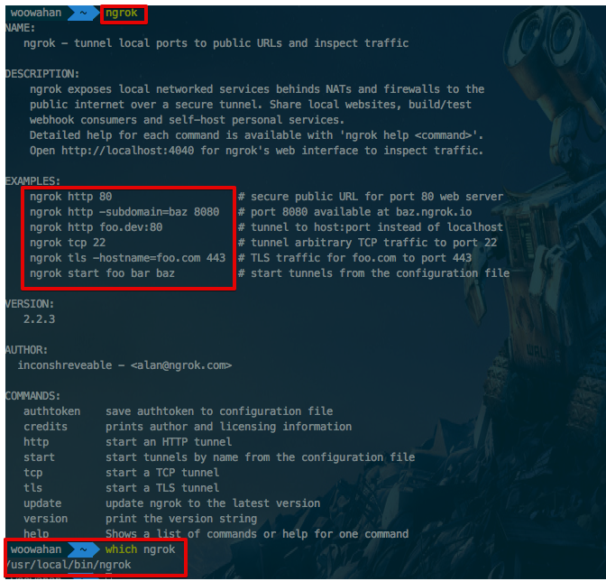

EXAMPLES에 나와있듯이, 현재 로컬에 열려있는 포트 중 외부에 열고자 하는 포트를 입력하면 바로 ngrok 도메인과 연결해줍니다.  
젠킨스 컨테이너의 포트는 젠킨스 접속시 사용하는 포트(저는 32771입니다)이니 이를 ngrok과 연결하겠습니다.  

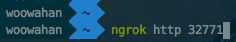

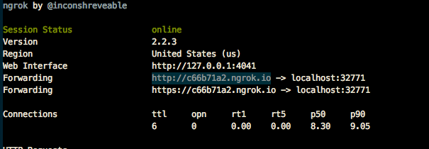

보시면 ```http://c66b71a2.ngrok.io/```과 연결되었음을 확인할 수 있습니다.  
브라우저에서 연결된 호스트로 접속해보겠습니다.  


짠! 이젠 외부에서 저희의 젠킨스 컨테이너로 접속을 할 수 있게 되었습니다.  
즉, **Github에서 webhook**을 할 수 있게 되었습니다.  
좀 전에 열어둔 Github service 페이지에 있는 Jenkins hook url에 ngrok 주소를 입력하겠습니다.  

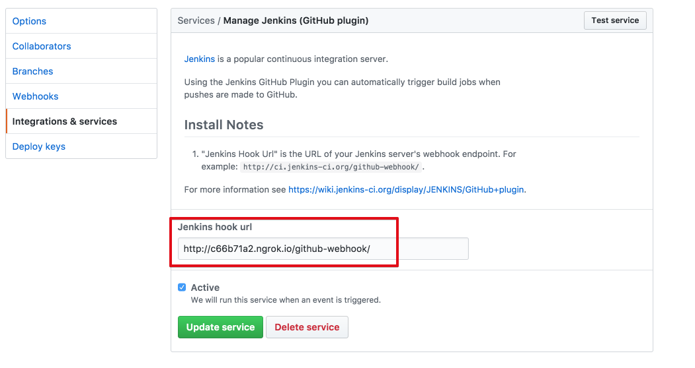

주의하셔야할 점은 본인의 **젠킨스 주소 뒤에** ```/github-webhook```을 추가해야하는 것입니다.  
깃허브가 푸시가 되면 해당 ```path```로 hook을 하기 때문입니다.   
(젠킨스의 깃허브 플러그인으로 ```/github-webhook```는 이미 젠킨스에 포함되어 있습니다.)  

자 이제 젠킨스와 Github의 연동이 끝났습니다!  
그럼 확인을 해볼까요?  

### 젠킨스 테스트
먼저 젠킨스의 Job 수행이 잘되는지 확인하겠습니다.  
메인페이지를 보시면 일전에 등록한 Item이 바로 보이실텐데요, 해당 Item을 클릭하시고,  

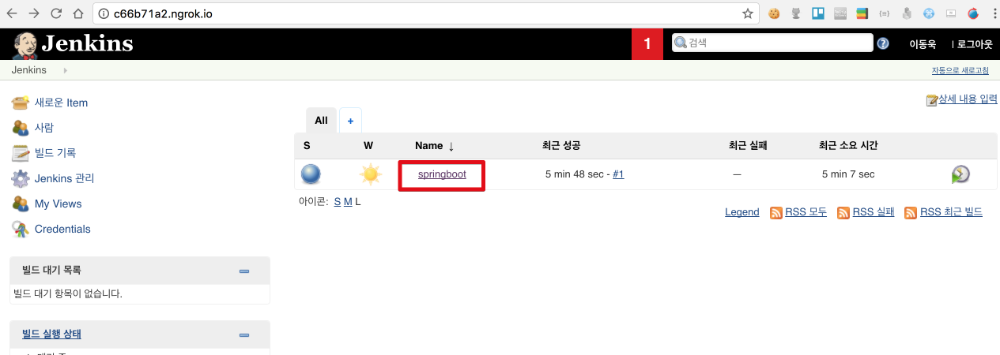

다음 화면에서 ```Build Now```을 클릭하시면 바로 빌드를 수행하게 됩니다.  

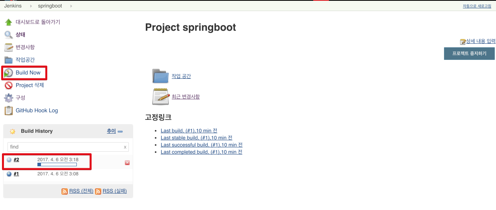

젠킨스 빌드가 끝나면 한번 확인해보겠습니다. ```Build History```에서 가장 최근에 빌드된 내역을 클릭하시고 ```Console Output``` 을 클릭하시면!  

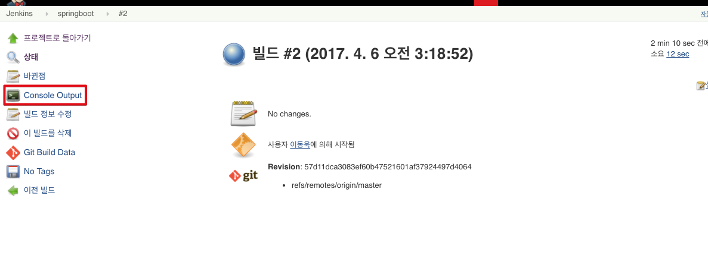

이렇게 빌드가 잘 수행된것을 확인할 수 있습니다.  

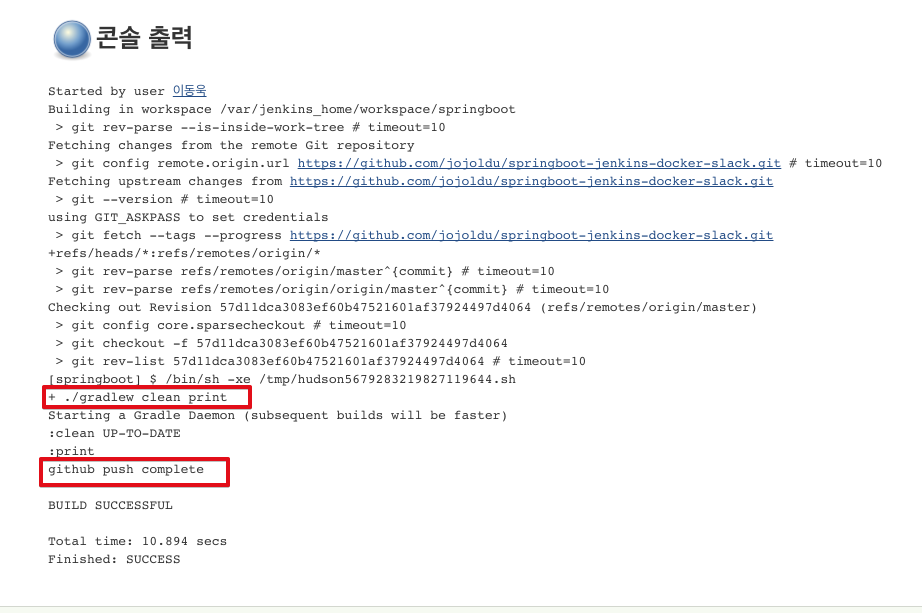

젠킨스의 빌드 기능은 확인되었으니, Github hook이 잘되는지도 확인하겠습니다.  
본인의 프로젝트를 수정 후, ```git push```를 수행하겠습니다.  
(현재 ```master``` 브랜치에 hook을 걸었기 때문에 다른 브랜치는 안됩니다.)  


## Java


## 참고
* [iamkyu.com](http://www.iamkyu.com/121)
* [젠킨스 위키](https://wiki.jenkins-ci.org/display/JENKINS/GitHub+plugin)